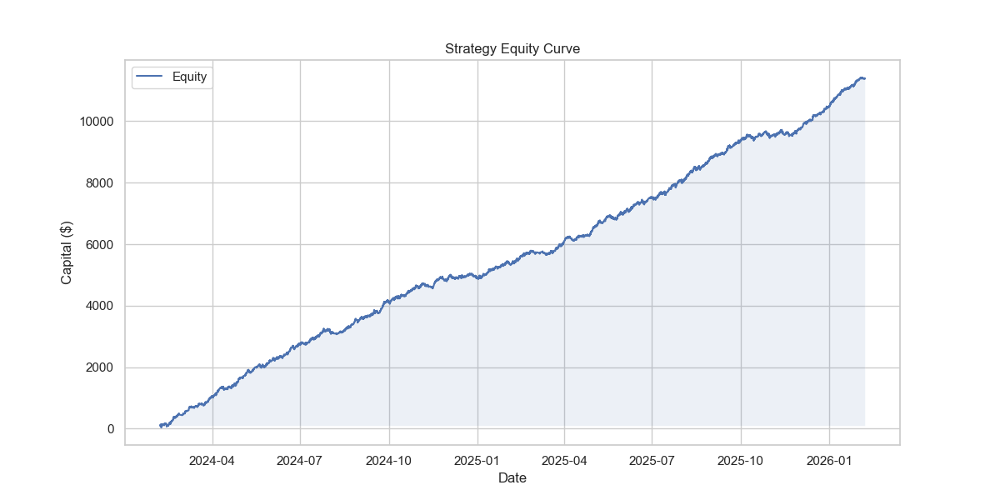
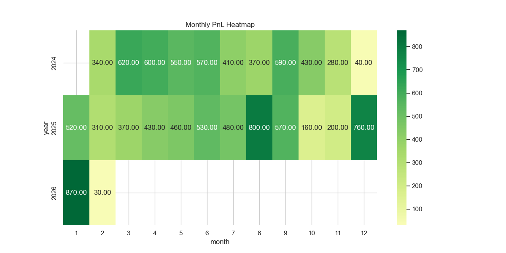
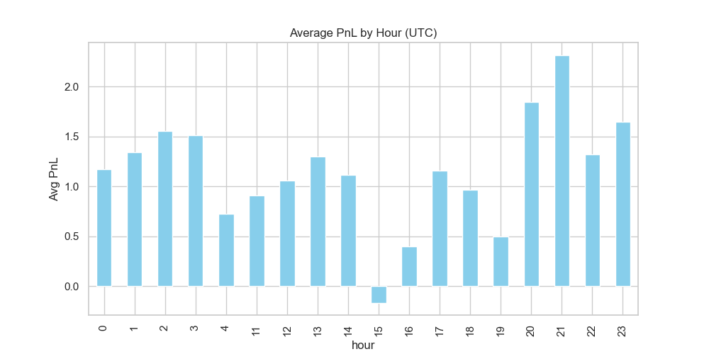
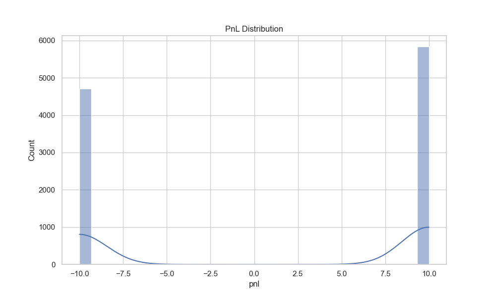
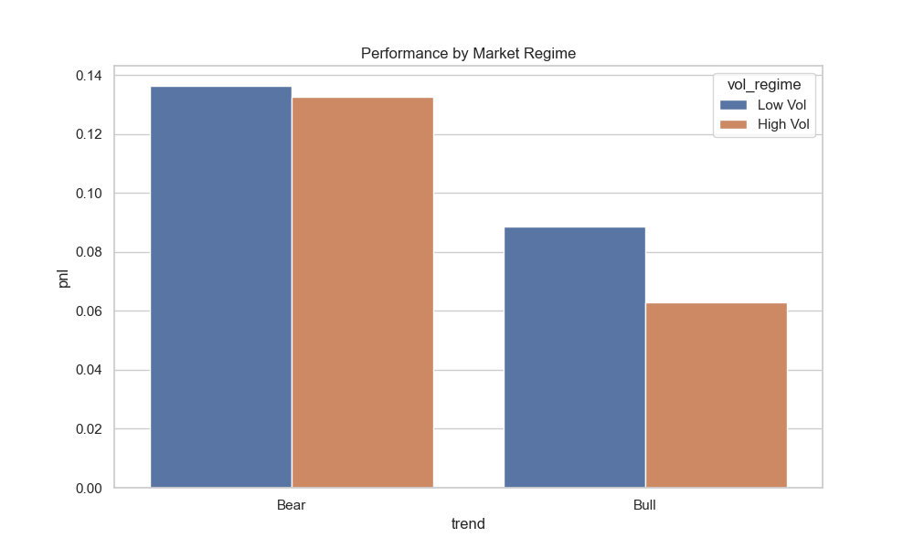
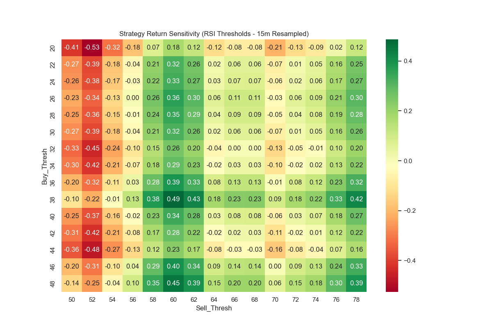
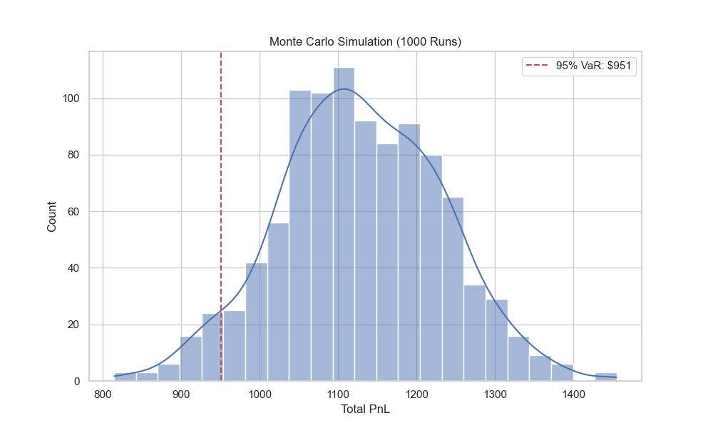

# Professional 2-Year Trading Strategy Analysis
Generated: 2026-02-07 15:16

================================================================================
EXECUTIVE SUMMARY
================================================================================

Win Rate: 55.35%
Total PnL: $1129.00
Sharpe Ratio: 8.56
Max Drawdown: $21.00
Recent Win Rate: 58.63%


## Visualizations














## Signal Quality
```
SIGNAL QUALITY REPORT
=====================

Performance by Signal Type:
        Count   Avg PnL  Total PnL  Win Rate %
signal                                        
NO       5485  0.116864      641.0   55.843209
YES      5066  0.096328      488.0   54.816423
```

## Benchmark Comparison
```
Strategy: 1129.00%
BTC B&H: 58.98%
```

## Regime Performance
```
MARKET REGIME PERFORMANCE
=========================
                  count    sum      mean
trend vol_regime                        
Bear  High Vol     2848  378.0  0.132725
      Low Vol      2302  314.0  0.136403
Bull  High Vol     1635  103.0  0.062997
      Low Vol      3766  334.0  0.088688
```

